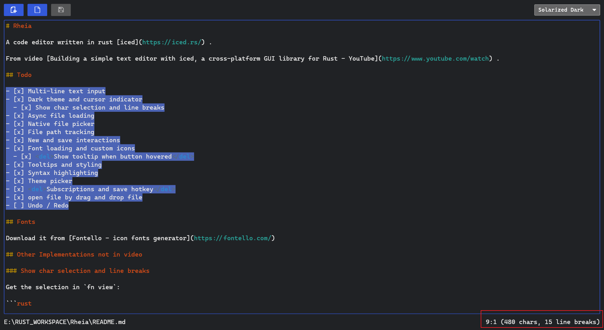

# Rheia

A code editor written in rust [iced](https://iced.rs/) .

From video [Building a simple text editor with iced, a cross-platform GUI library for Rust - YouTube](https://www.youtube.com/watch) .

## Todo

- [x] Multi-line text input
- [x] Dark theme and cursor indicator
  - [x] Show char selection and line breaks
- [x] Async file loading
- [x] Native file picker
- [x] File path tracking
- [x] New and save interactions
- [x] Font loading and custom icons
  - [x] <del>Show tooltip when button hovered</del>
- [x] Tooltips and styling
- [x] Syntax highlighting
- [x] Theme picker
- [x] <del>Subscriptions and save hotkey</del>
- [x] open file by drag and drop file
- [ ] Undo / Redo

## Fonts

Download it from [Fontello - icon fonts generator](https://fontello.com/)

## Extends

### Show char selection and line breaks



Get the selection in `fn view`: 

```rust
// src/editor.rs
let select = self.content.selection();
```

Get chars(selection length) and count line breaks

```rust
// src/editor.rs
match select {
  None => text(base_info),
  Some(select) => {
      let breaks = select.matches('\n').count();
      let extra_info = if breaks > 0 {
          format!(" ({} chars, {} line breaks)", select.len(), breaks)
      } else {
          format!(" ({} chars)", select.len())
      };
      text(format!("{}{}", base_info, extra_info))
  }
}
```

### Open file by drag and drop file

[](https://youtu.be/rrkZqg-zCEE)

Add file drop message :

```rust
// src/editor.rs
pub enum EditorMessage {
    ActionPerformed(text_editor::Action),
    FileOpened(Result<(PathBuf, Arc<String>), EditorError>),
    OpenFile,
    NewFile,
    SaveFile,
    FileDropped(PathBuf), // file drop message
    FileSaved(Result<PathBuf, EditorError>),
    ThemeChanged(highlighter::Theme),
}
```

Subscription file drop event

```rust
// src/editor.rs
pub fn subscription(&self) -> Subscription<EditorMessage> {
  event::listen_with(|event, _status, _windows| match event {
      Event::Window(window::Event::FileDropped(path)) => {
          Some(EditorMessage::FileDropped(path))
      }
      _ => None,
  })
}

// src/main.rs
fn main() -> iced::Result {
  iced::application("Rheia - Iced", Editor::update, Editor::view)
      .theme(Editor::theme)
      .default_font(Font::MONOSPACE)
      .font(include_bytes!("../fonts/editor-icons.ttf"))
      .subscription(Editor::subscription)
      .run_with(Editor::new)
}
```
